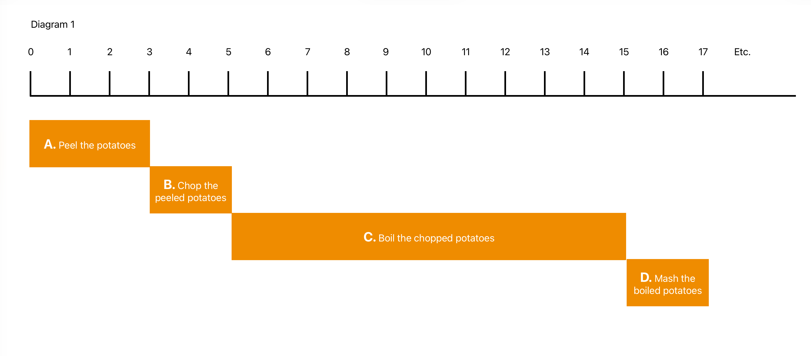
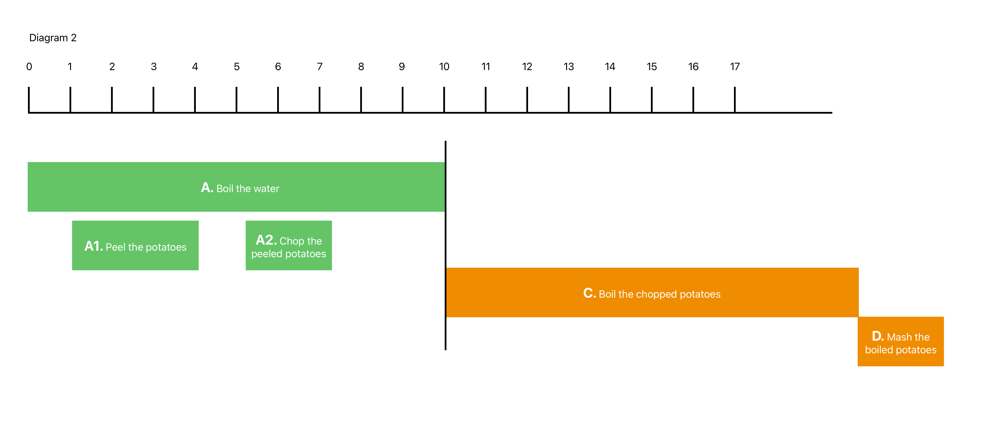
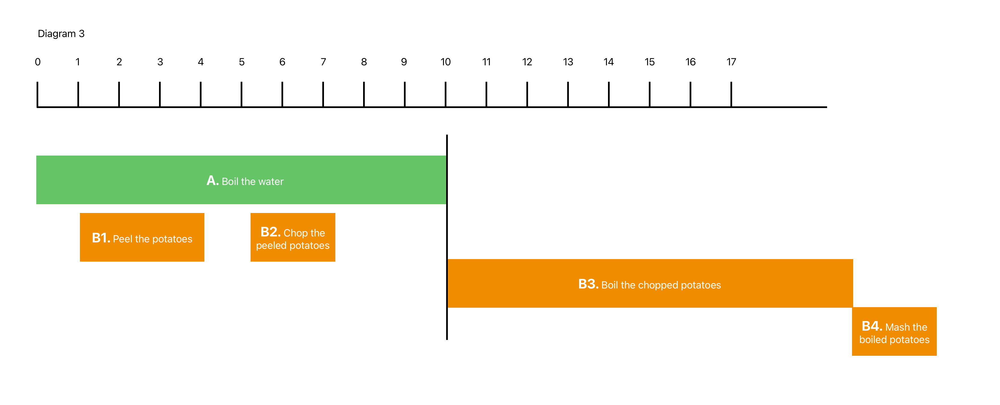
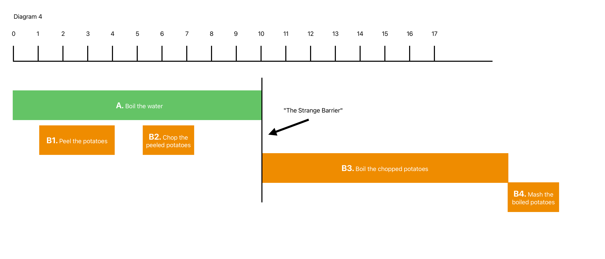
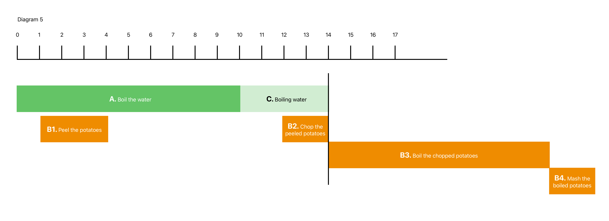

# Life at the NowLine.  
  
### The unavoidable mixing of **metaphors.**  
  
When the idea for NowCook first came to me, it was before the personal computer had been invented. I was at home, planning a small dinner party for friends, and I had three recipe books open on the kitchen counter. Choosing the dishes I was going to cook had been a pleasure — it is well documented that the browsing/choosing process is a universally pleasant part of the overall cooking experience for the majority of people, regardless of their skill level or more experience. This is principally why recipe books in stores are so enticing and photography-rich.  
  
I had to mentally process the demands of the four dishes I’d selected from the three books:
  
A starter/appetizer
The main course: a fish main, two vegetable side dishes
Dessert

Creating the shopping list had been mechanical, but still tedious, as there were several ingredients that appeared in more than one recipe, but as each book was the work of a different author, had been classified using different colloquial language or units of measurement: “8oz of butter”, “A large knob of butter”, etc. These repeated ingredients needed to be rationalized manually in a notebook, adding quantities together, then rounding up to make sure I wouldn’t find myself short of something during the actual cooking. Example: if the sum total of butter required for the entire meal is 18.5oz, I can’t buy 18.5oz; I have to buy 3 x 8oz packs. 

Already, the day BEFORE the dinner event, there is a low-level ambiguity and anxiety present — a subtle “stage fright” inherent in the reality of the process even at the shopping list stage. Add to that, the list one makes — drawn from the three books — bears almost zero correlation to the layout of a supermarket. The cook’s shopping list is written as items are called for on the printed page across the books. Yet a supermarket is ordered and departmentalized. Again, we have very early dislocation from “reality” — the reality of what I need to buy vs the reality of how those items are presented to me in a physical store. Anxiety (not life-threatening, but still anxiety) builds.  
  
> *My in-person research/interviews with home cooks revealed that some people actually even abort the process AT THIS point. The prospect of “messing up with quantities and having to make more than one trip to the supermarket to correct their ingredient math” is enough on its own to make them abandon the chosen recipes and “downgrade” their cooking plans to dishes they’ve made before and are ‘comfortable’ with*.  
  
So we’re only reached shopping lists. Yet this is an account and a recounting of what happens in real life, at the human level.   
  
There were no smartphones when I was planning this particular meal, just pen and paper and my own common sense. Now, there are a thousand shopping list apps available on the App Store. However, they tend to present generic ingredient options and are as much “extra” work” as they are any kind of solution. Because they aren’t intrinsically connected or “aware” of the recipe(s) on the schedule, they are only a partial, dislocated accessory.   
  
So, for the vast majority of home cooks planning anything more of a stretch than a family "functional" meal, nothing has really changed in those in the 40 years since that night I was planning my dinner offering. I feel this seemingly trivial reality needs acknowledging. It's the first pain point. And often sufficient to stall the whole process.   
  
++Metaphor #1: GPS ++  
  
If Google Maps, Apple Maps, or Waze were taken away from drivers today, most of them would not be able to find their way anywhere. There are almost zero printed maps still available to buy. And the act of pulling the car over and unfolding a map (that might be out of date) to see where you are and where you need to go feels like ancient history.   
  
NowCook is not intended to be a cooking “patch”. It’s not intended to take the edge off pain points. It’s intended to provide the equivalent level of navigational assistance provided by a GPS app, running on your smartphone, in the car, on a mount, on your dashboard, in your eyeline, that “knows” where you are — *exactly* — and how to get from “here, now” to “there, by then”.   
  
People walk to their car. They type the address they’ve been given by a friend or colleague into their GPS maps app, wait for the blue line of the route to appear, and drive out of their home driveway without needing to wonder whether or not they will make it to that destination. Barring accidents, they know they will, and they know they don’t have to plan, or predict, or doubt, or even preview the designated route.   
  
Their ETA is a factor. Perhaps they’ve used the app’s capability to input a desired arrival time, so that it can tell the driver the (reverse-engineered) necessary departure time (“leave by”). The GPS considers data amassed from countless similar routes taken by other drivers at that time of day, using those roads, and is able to determine the likely duration with a supreme level of accuracy.   
  
And yet, the humble cook, just wanting to feed the family… try something new… use that new cookbook… has to work everything out in their own heads, with scraps of paper, and by reading pages of colloquial, formless, stylized instructions, tips, and techniques.

The similarities between cooking a multi-dish meal and making a road trip are not 1:1, but they do present many aspects that are as near as you can get, and the driving problem has been solved. The cooking problem has not. NowCook is that equivalent solution. 

Also, whilst staying with this metaphor, the GPS apps do not aim to change how a driver operates their car. The accelerator remains the accelerator. The rules of the road remain the rules of the road. Driving is still driving.

Likewise, NowCook is not intended as a reinvention of the cooking process. A pan of boiling water is still just that. The butter you need for the next task is IN the fridge. NowCook hasn’t made it magically appear on the cutting board, with the right knife and a set of scales. This is why all tasks allow for the reality of a normal person cooking normally. These are not professional chefs with a staff of assistants who show up early to prepare mise en place. The normal cook is told to chop the onion finely. That means they have to go to the drawer, get the knife; walk across the kitchen to get the cutting board and the onions, THEN start chopping. That’s potentially a minute spent already. If the author of the recipe (or the algorithm behind NowCook estimates it takes a normal person one minute to chop one onion, then that’s an estimated two-minute task. 

Anyway, back to my dinner party forty years ago. 

(Note: *this is an exploration of object-level relationships, not UI design*)

It went without saying, obviously, that one cannot cook anything if one hasn’t first acquired the necessary ingredients. Moving past that, I became aware — as a person who used Gantt charts in my working life — that there was a dependency chain element to a recipe that was annoyingly ignored by the dishes’ authors. 

task B couldn’t start until task B had been executed. And task B needed task C to at least be underway before it was ready to start. And nothing in Recipe 2 was worth even beginning until Recipe 1 was at least 2/3rds complete, otherwise it would be over-cooked and spoiled. Then there was dessert. Well that’s served cold, but has to cool down in the fridge for two HOURS! That means I’d better do that first, otherwise it won’t be cold. But if I start that now, how will I also tackle Recipe 1 which takes two hours? I only have one pair of hands.

What should I do first? I could have made these desserts last night! I could have prepped some of the ingredients for Recipe 2 this morning before I went to work. I could have, I should have, I ought to have… Now I have to MAKE it work. I have no choice. It feels like setting off to the airport in the car, knowing I now HAVE to get there in 45 mins or I miss my flight and I don’t REALLY even know the way. (The GPS metaphor never really leaves the stage).

Anxiety notches up several degrees. The “joy of cooking” begins to mutate into the “chore of cooking”.

At the time, as a user of project management software, I was able to at least realize that tasks were not simply linear; that each had an approximately knowable duration; that top-level dependency chains were “hiding” in the prose, but that there were also secondary chains waiting to catch me out. So I got a large piece of paper and started to draw a basic Gantt chart.

Using colored bars to represent tasks and a crude scale of 1 in equals 1 min I started trying to translate the paragraphs of written text from the recipe into discreet actions that formed discreet chains.
  
  
  

This already felt like progress to me, at a visceral level. Like I was revealing a secret hidden in the recipe. Unlocking a code. Translating a cipher. But it was incomplete. How could I boil the chopped potatoes if I hadn’t filled a large saucepan with cold water and brought it to a boil? That’s another task, but it didn’t fit between B and C. I could see that A and B could be done whilst the water was being heated. I had no real grand ideas of concurrency rules or the algorithms that could come from the potential of exploiting simultaneity. I just sensed that there was an amnesia “only” and a “whilst” and a “before” and a “when/after” pattern emerging. Which led to: 

  
  
A scenario where A1 and A2 could be performed in a linear manner WHILST the water was boiling, yet all three green tasks HAD to be complete, before the orange tasks could be started. So there was a curious mix of groups and chains.

I could already see that A1 and A2 had nothing in fact to do with A, but were in fact part of the Orange dependency chain that COULD be performed *during* A. So:  
  
  
But what was this:  
  
  
  
B3 is dependent on A reaching a state of readiness (boiling). But it’s ALSO dependent on the completion of B2, which is dependent on completion of B1. So, if I DON’T execute B2, during A, I get this:  
  
  
Tasks B3 being pushed *forwards* in time by my failure to execute B2, even though A is complete.
My water is boiling away; I can still execute B2 whilst it boils, but it won’t boil forever…it will start to boil away.   
  
What an unusual reality. Hiding right in the text, but unspoken.   
  
This is how all the above might appear in the long-form prose of a traditional printed recipe:  
  
> "*Peel and chop the potatoes, then add to a large pan of boiling water. When soft, drain the potatoes, return to the pan and mash with the butter, chopped garlic and milk*."  
  
Mashed potato is hardly a complex example, but even given that, the structure is kept obscured. Left for the cook to untangle.   
  
And if mashing potatoes were all the cook had to do, this would be a pointless essay.   
  
But the mashed potatoes are destined to be spread (whilst still malleable) on top of a fish pie base, comprising fresh fish, shrimp, chopped spinach, and a sauce that has ten preparation steps of its own. These two elements -- the fish center and the mash topping — have to have completion times that pretty much coincide, or the mash turns into an unusable brick.   
  
"Can the sauce be made in advance?"  
Can the fish be prepared with the other steps, maybe even before the sauce?"   
I will have to read the recipe again."  
  
Turns out both are true. I could have made the sauce the night before and left it overnight in the fridge. I could have prepared the other fish and vegetable ingredients before even starting the mashed potatoes. The whole pie base could have been finished and waiting for the easy process of making mash to go on top. No stress. Maximum efficiency. No rushing. No reverse engineering against the clock.   
  
And that was the birth of NowCook.   
  
In short: “Well, there HAS to be a better way than this." (Remember, this was still decades before GPS or mobile phones, even laptops, so my only thought was "I should write a cookbook where the instructions are laid out as a pseudo Gantt chart. It would have no interactivity or intelligence per se, but it would at least reveal the hidden code.”   
  
Until I tried it.   
  
Yes, I could create an approximate visual representation of the original instructions but with the reality of so many branching variables -- different paths through the recipe maze -- that the paper version of MealMap was ultimately more confusing to the layman cook than the devil they knew - a good ol' printed recipe.   
  
Example: how to show the reader that they "could" do any of the following seven tasks? But only if it's less than three hours before when they need to serve.   
  
Or, “Welcome to this fish pie meal. If it's the day you intend to serve this, you COULD have done most of these tasks last night."  
  
This is not helpful to anyone.   
  
It took several years for the laptop to appear. But the few who had one would never think to bring it into the kitchen.   
  
It took smartphones and the internet and iPads for NowCook to be dusted off and reconsidered as a viable "app". Because a book cannot offer control over the ONE ingredient in ALL of cooking that determines whether a meal succeeds or fails:  
  
# **…TIME**.  
 
––––––––––––––––––––––––––––––––  
  
  
# The Genesis of the NowLine
  
Obviously there are years and detours and despair and progress that passed by during all this, so jump forward to when the iPad at least was something people were okay with bringing into the kitchen.   
  
The above diagrams are representative of the hundreds of attempts to visually depict the truth of dependencies and simultaneity in cooking the cooking process.   
  
But none of them really "stuck“ and I couldn't work out why, other than the fact that, although the tasks were reasonably well associated with each other (dependencies, durations etc), there seemed no way to establish their relationship to "now".   
  
With a GPS navigated drive, the driver always knows where he is "now".   
  
What use are tasks that know pretty much where they are in relation to each other, but don't know where they are in the space of the cooking "journey" to a finished meal?   
  
I had a basic line representing "now", as does every Gantt chart. But it had always been my greatest criticism of Gantt charts that takes just sailed through that line, whether they'd actually been started or not.   
  
What is the point of a task that appears (visually) to be halfway done (because it's halfway over the line) when the person responsible for completing it hasn't even considered starting it yet?   
  
And then a word came to me, from nowhere.   
  
"Log jam"   
  
(Metaphor #2)  
  
What if a task, represented by an object on the timeline, doesn't just pass under that line, but instead, the line stops it in its tracks? If that task stops, then surely all its dependents would also have to stop?   
  
Like a log jam.   
  
The front task would have to have its "owner" dislodge it from this barrier and by doing so make the statement that "I've started this". Surely that's a far more accurate representation of reality? In a business project management situation, any hold-ups would have an immediate, identifiable reason.   
  
Task 34 is stopped at "now", because the person responsible for it hasn't started it, or at least hasn't indicated that they've started it.   
  
Gantt projects are generally far more intricate and complex than cooking projects. Teams and departments. Longer time frames. States of completion that are harder to clearly define. Milestones and critical paths.   
  
Cooking seems so simple by comparison.   
Tasks mostly have finite durations. Meals are mostly cooked by one person. The whole process is mostly started and attended until completion. The lexicon of ingredients and tasks and processes is finite. (In business, every single project is infinitely different from the last. Different intentions, different skills, different markets...)  
  
And then it all seemed to snap into focus.   
  
The line passively representing "now" on a Gantt chart simply needs to be made ACTIVE. It needs to be brought into play. It needs to be a "turnstile" (metaphor #3)  
  
All the problems related to cooking tasks and chains being "aware of where they are" in relation to "now" and "start" and "serve" just evaporated.   
  
Everything suddenly made sense. Even if it did then take time to unlock all the ramifications and possibilities. But that doesn't matter now.   
  
**The effect of the NowLine**  
  
As we've already established that a mealMap is essentially calculated from the project's end time (serve time) backwards to "now”, every single task can only be classified one of the following ways:  
  
* Can do now (if started now, the meal can be executed successfully, either by the chosen serve time, or whenever, without anything being spoiled)  
* Can't do yet. (It's too early -- see above -- or it's dependent on some other task.)   
* Has been done (as passed completely under the NowLine and reached its definition of doneness).  
* Could do now (the user has choices, as they do in real life, and choosing one dictates the adjusted state of all the others. Example: start "chop the carrots" turns "slice the onion" from its original "Can do now", into a "Can't do yet", because each task requires the sole attention of the cook.   
* Must do (if you don't do this now, it will spoil or you'll be jeopardizing your serve time).  
  
And everything subsequently made sense.   
At least in theory.   
Coding it to work was not in my skill set, but was within the capability of my developer partner. And NowCook was officially started.   
  
The user's interaction with the NowLine.   
  
Ignoring all the aspects of getting a recipe into NowCook -- ingestion, parsing, etc. -- when a user has opened a MealMap, the NowLine shows... the time now.   
  
"Now" might actually still be a whole day ahead of when the user wants to serve. But that no longer matters. There might already be n tasks "sitting at the NowLine" as "could do now" tasks.   
  
Example: all the tasks related to the cold dessert that has been chosen for the meal, because the preparation of the same can be done an entire day ahead, and kept in the fridge.   
  
Example: a pie crust could be made from scratch and kept for tomorrow.   
  
Example: the first task in a dependency chain representing a complete sauce prep could be started any time between now (currently the day before) and an hour before serve time.   
  
Tasks that can't possibly be started until close to serve time (steam the broccoli) are nowhere near the NowLine. Other than purchasing broccoli, the user doesn't have to even contemplate that task or tens of others until they reach the NowLine and transform into "Can do now" items.   
  
Here's where we fall back on trusty GOS metaphor again.   
  
A driver doesn't need to know that in five turns’ time, he'll be asked to change lanes and take a right. It doesn't matter to him. Because right now the only thing that is a "Can do now" is "In 400 yards turn left".   
  
That's all he needs to know.   
  
He can choose to swipe ahead out of sheer curiosity, but then so can the user of a MealMap.   
  
Right now, you could do one of these five things, or if you don't want to do them yet, they're just going to sit there until you let one of them through the turnstile... release it from the log jam that is the NowLine... allow it to go through passport control.   
  
This will require a physical tap or double tap of the task in the UI to start an action. If all the Can-dos are showing green, and one is chosen with a double tap, all the other Can-dos become Can't do yets; turn gray; and the chosen task starts moving under the NowLine at the speed of 1sec = x pixels.   
  
If it finishes earlier than its defined duration, the user can dismiss it as done with maybe a swipe or another double tap.   
  
Now here's the clever part.   
  
If an active task's rightmost "finish" edge reaches the NowLine, it doesn't just keep moving out of frame. It stops.   
  
It might not actually be "done" yet. In the real world. Perhaps the starting temperature of the ingredient was particularly cold, so the heating took longer. Perhaps the user is a slow slicer. Perhaps the user isn't in a particular hurry.   
  
The task stops at the NowLine and everything dependent on its ACKNOWLEDGED completion has to stop too. Like a train at a stop signal (metaphor #4)   
  
The meal has either partially or completely stopped. A dependency chain may be stopped whilst other tasks (not in that chain or dependent on the whole chain at all) carry on uninterrupted.  Either way, it's the real depiction of how real cooking works in a real kitchen.   
  
If the whole meal has been halted by a finished task. It yet released as done from the NowLine, then perhaps the Serve Time starts moving 1:1 later than anticipated. This might be a big red flag (if guests are expected), or it might be inconsequential to the user, for whom a family meal pushed back by 15 mins is neither here nor there.   
  
This is coded elasticity. It allows for what really happens when cooking. Some things take longer. Some things take less time. Some things you decide you're going to get from a can, rather than make from scratch (allowing you to dismiss an entire sub-chain as done). Some things you just happened to have already ( a bag of grated cheese). Some things refused to come to a boil -- that's okay. Everything dependent on it boiling is stopped at the NowLine.  
  
No panic. No overwhelm. No ambiguity. No need to know what you don't need to know yet.   
  
A journey you've never taken before is no longer a cause for anxiety.   
  
It's not a "how to cook" (although per-task how-to video clips are an obvious value-add down the line), in the same way that Google Maps is not a "how to drive" app.   
  
I'll end there. And let that all sink in.   
  
Hope it's clear and provides greater clarity.   
  
  
  
